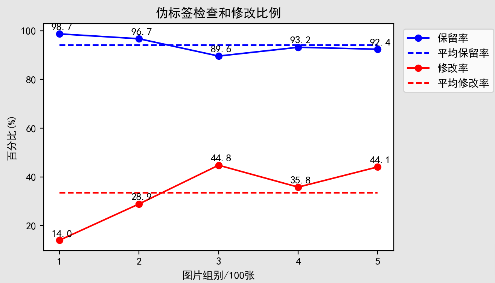

[TOC]


# 1、代码库功能

> 使用谷歌的MediaPipe 算法库获取单人图像/视频的边界框和关键点伪标签信息。由于MediaPipe提供接口比较丰富，且算法精度高，所以得到伪标签一般质量都比较高。
## 1.1、MediaPipe

+ [MidiaPipe官网](https://google.github.io/mediapipe/)
+ [GitHub仓库](https://github.com/google/mediapipe)


--------

## 1.2、半自动手部关键点标注工具

[GitHub:LabelKPs](https://github.com/Runki2018/LabelKPs/tree/main)

项目路径：`\\192.168.16.105\data_huangzhiyong\annotation_tools\LabelKPs`


​		上图所示是之前为亿智手势数据集标注关键点开发的标注工具，同样是基于MediaPipe进行手部关键点检测，在获取图片数据集的关键点伪标签后，读入伪标签进行检查和修改。



​		如上图所示，500张图片的统计数据中,去除模糊和手部漏检等图片后，能保留下来的可用图片大概占94.1%，而在可用图片上进行关键点修改的比例大概是33.5%，说明基于MediaPipe的标注工具，可以有效节省标注工作量，目前这个工具在申请亿智的发明专利。

​		原本打算在这个项目的基础上进行修改，让其支持人体关键点，但由于时间问题，目前项目还有些bug，后续会增加对人体关键点的支持。所以，下面采用了一种更简单直接的方法，不修改伪标签，只保留高质量的伪标签。


# 2、目录结构

获取人体关键点伪标签的项目路径：`\\192.168.16.105\data_huangzhiyong\annotation_tools\mediapipe_pose`

| 编号 | 文件或目录            | 功能                                                         |
| ---- | --------------------- | ------------------------------------------------------------ |
| 1    | vis_images/           | 存放视频可视化的帧图像(jpg格式)的默认目录                    |
| 2    | annotations/          | 存放可视化帧的标注文件(json格式)的默认目录                   |
| 3    | videos/               | 存放所有待处理的视频的默认目录                               |
| 4    | merge_datasets/       | 存放最终数据集的默认目录                                     |
| 5    | get_image_pose.py     | 获取指定路径下所有图片的伪标签                               |
| 6    | get_video_pose.py     | 获取指定路径下所有视频的伪标签                               |
| 7    | generate_dataset.py   | 生成最终数据集，包括原图和高质量伪标签                       |
| 8    | my_coco_tools.py      | 读入和解析COCO数据集格式的标注文件                           |
| 9    | extract_videos.py     | 递归地将源目录下所有的视频拷贝到目的目录                     |
| 10   | video_pose_utils.py   | 工具类                                                       |
| 11   | checkup.py            | 检查生成的数据集标注信息是否正确，即原图与伪标签是否对应     |
| 12   | mediapipe_modules.zip | 存放mediapipe模型文件的压缩包，选择不同等级的检测模型时，按需提取。 |

---------------


# 3、标注流程

1. **获取伪标签和可视化图片帧**，执行`get_image_pose.py `或 `get_video_pose.py `
   1. 执行脚本前，先清空输出目录，如`annotations/`和`vis_images/`
   2. 可以先加如`--show`观察伪标签生成是否正确，再加上`--save`参数保存伪标签
2. **筛选可视化图片帧**，推荐使用Windows图片查看器去除检测结果质量低的图片，快捷键: '→'键 下一张, 'Del'键 删除当前图片。
3. **生成最终数据集**，完成步骤2去除低质量帧后，执行`generate_dataset.py`，该脚本会根据保留下来的高质量伪标签，生成最终数据集。


# 4、get_image_pose.py

该Python脚本用于获取图片数据集的伪标签，下面对该脚本的参数说明：

| 编号 | 参数名          | 功能                                                         |
| ---- | --------------- | ------------------------------------------------------------ |
| 1    | --img           | 待处理的图片数据集目录                                       |
| 2    | --interval      | 图片采样间隔，用于跳过相似的连续视频帧，默认值为1            |
| 3    | --auto-interval | 使能自动采样间隔，默认为假。自动计算当前帧与后续帧的关键点相似度，相似度高的直接跳过。 |
| 4    | --show          | 可视化，边生成伪标签，边观察伪标签生成是否正确，默认为假。按'q'退出观察。 |
| 5    | --save          | 保存伪标签，默认为假；                                       |
| 6    | --save-img-root | --save起用时，输出可视化图片的路径，默认值为"./vis_images"   |
| 7    | --save-ann-root | --save起用时，输出关键点标注文件的路径，默认值为"./annotations" |

```shell
# 例子1： 先观察伪标签生成，确定interval/auto-interval参数的作用
python get_image_pose.py --img your/imgs_dir --show
# 例子2： 保存伪标签
python get_image_pose.py --img your/imgs_dir --save
```


# 5、get_video_pose.py 

该Python脚本用于获取视频数据集的伪标签，下面对该脚本的参数说明：

| 编号 | 参数名          | 功能                                                         |
| ---- | --------------- | ------------------------------------------------------------ |
| 1    | --file          | 待处理的单个视频文件或多个视频所在的根目录                   |
| 2    | --video-dir     | 默认的视频读入目录，如果--file是目录，且与video-dir不同时，将--file里的所有视频，拷贝到--video-dir目录下，默认值为'videos' |
| 3    | --interval      | 图片采样间隔，用于跳过相似的连续视频帧，默认值为4            |
| 4    | --auto-interval | 使能自动采样间隔，默认为假。自动计算当前帧与后续帧的关键点相似度，相似度高的直接跳过。 |
| 5    | --show          | 可视化，边生成伪标签，边观察伪标签生成是否正确，默认为假。按'q'退出观察。 |
| 6    | --save          | 保存伪标签，默认为假；                                       |
| 7    | --save-img-root | --save起用时，输出可视化图片的路径，默认值为"./vis_images"   |
| 8    | --save-ann-root | --save起用时，输出关键点标注文件的路径，默认值为"./annotations" |

例子:

```shell
python .\get_video_pose.py --file .\videos\1.mp4 --show
```

