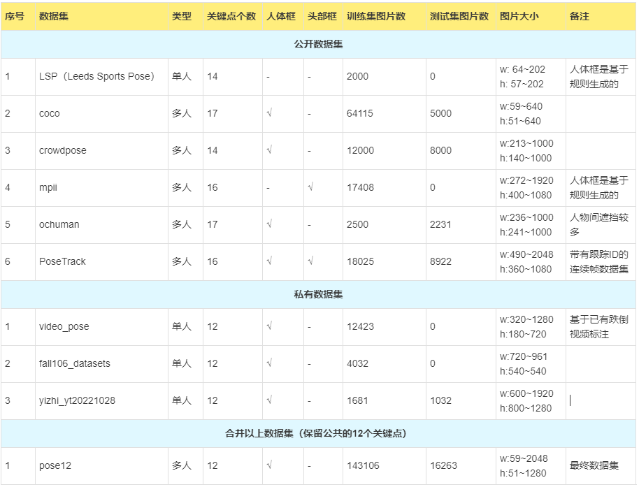
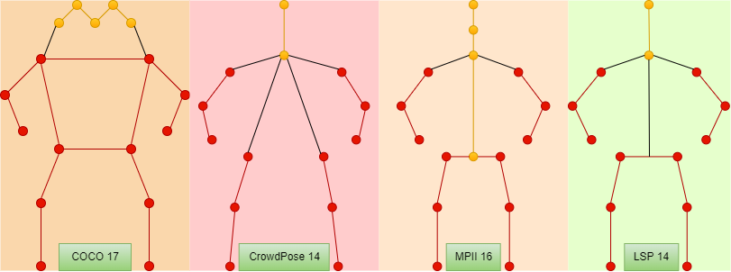
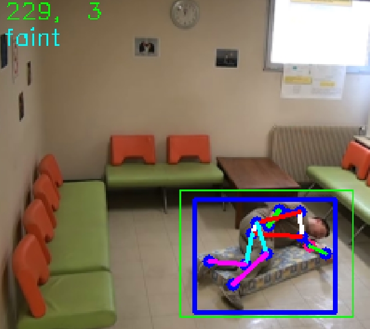

<center> <font size=10>数据集<center>

---------

目录：

[TOC]

# 1、姿态数据集

姿态数据集的存放路径：`\\192.168.16.105\data_huangzhiyong\datasets\pose_datasets\`



公开数据集，共140201张图片。为了提高跌倒姿态的识别准确率，对一些跌倒相关的视频和图片进行标注，得到私有数据集。私有数据集， 共19168张图片，通过MediaPipe获取的高质量的关键点和边界框伪标签。

## 1.1、公开数据集



​		对于公开的2D人体姿态估计数据集，主要有三种标点方式，如上所示是四个公开数据集的关键点，其中CrowdPose和LSP是14个相同类型的关键点。在KAPAO模型的训练中，我只保留所有公开数据集都包含的12个关键点(如上图红色点)，即**左右肩部点（shoulder）、左右手肘点(elbow)、左右手腕点(wrist)、左右臀部点(hip)、左右膝盖点(knee)和左右脚踝点(ankle)**。此外，对于所有的公开数据集，标注文件的存储格式和表示方式存在一定差异，为了便于使用，我把各个数据集的标注文件都统一转换为COCO数据集标注格式。

​		除了以上四个数据集之外，还有两个带有特色任务的公开数据集，即OC Human和PoseTrack数据集。OC Human的样本主要是两个人相互遮挡的场景，标注格式与COCO数据集相同，而PoseTrack数据集与MPII数据集来源于同一批运动视频，但不同的是PoseTrack标注了视频中间连续几秒的图像帧，并带有目标跟踪ID。

​	更多姿态估计相关的公开数据集可以参考商汤的[🔗MMPose项目](https://mmpose.readthedocs.io/zh_CN/latest/tasks/2d_body_keypoint.html)，包括2D/3D人体关键点数据集、2D全身人体关键点数据集、2D人脸关键点数据集、2D/3D手部关键点数据集、2D动物关键点数据集等。


## 1.2、私有数据集

一共标注了三个私有数据集, 每个数据集生成12个关键点和边界框：

+ **fall106_datasets**：图片源于网上的跌倒图片数据集，用于提高跌倒姿态的识别准确率。
+ **video_pose**: 图片源于跌倒视频，包括le2i Falldataset数据集中的部分视频和50种跌倒方式视频，用于提高跌倒姿态的识别准确率。
+ **yizhi_yt20221028**: 图片源自于亿智的手势识别视频，用于提高模型单人近距离场景和昏暗场景下的姿态识别准确率。


​		标注方式采用MediaPipe来自动获取图片上的人体关键点和边界框，然后保存可视化图片。人工筛选和保留检测效果质量高的可视化图片，最后根据保留的可视化图片生成最终数据集。

​	MediaPipe项目的路径：`\\192.168.16.105\data_huangzhiyong\annotation_tools\mediapipe_pose`

.jpg)


## 1.3、数据集目录结构

姿态数据集的存放路径：`\\192.168.16.105\data_huangzhiyong\datasets\pose_datasets\`

+ 根目录下有各个子数据集目录，以及生成最终数据集的`Python`脚本：
  + 保留指定的关键点，合并所有子数据集： `merge_dataset.py`
  + 将新加的数据追加到已有的合并数据集中: `merge_new_data.py`
  + 使用COCO标注的工具类: `my_coco_tools.py`
+ 对于每个子数据集目录，
  + `images`目录用于存放图片，`annotations`目录用于存放COCO数据集标注格式的`json`文件。
  + 非COCO标注格式的数据集目录下会有相应`Python`脚本用于生成COCO标注格式的`json`文件。
  + 每个目录下面有相应的`README.md` 说明文档。


## 1.4、 COCO标注格式

COCO格式的标注文件以json文件保存，每个json文件的主要内容包括三个数据项列表，分别是images, annotations, categories， 每个数据项列表的元素是一个字典，字典关键字的含义如下所示。

```json
{
     "images"   :[
     {
         "id": 0， # int, 图片的id
         "file_name": "015601864.jpg",  # str， 图片名
         "width": 1280, # 图片宽度
         "height": 720	# 图片高度
     }，
     # ... 其余包含图片信息的字典
 ],
    "annotations": [
        {
            "category_id": 1,   # 类别id, 人体姿态数据集只有1类，就是person 1
            "image_id": 0,		# 图片id，对于"images"字典中的id
            "id": 0,			# 标注id
            "num_keypoints": 16,  # 可见关键点的个数， vi > 0 表示关键点在图像范围中。
            "keypoints": [   # x1, y1, v1, ..., xn, yn, vn
                620.0,
                394.0,
                2.0,
                616.0,
                269.0,
                2.0,
                573.0,
                185.0,
                2.0,
                647.0,
                188.0,
                1.0,
                661.0,
                221.0,
                2.0,
                656.0,
                231.0,
                2.0,
                610.0,
                187.0,
                1.0,
                647.0,
                176.0,
                2.0,
                637.0201,
                189.8183,
                1.0,
                695.9799,
                108.1817,
                1.0,
                606.0,
                217.0,
                2.0,
                553.0,
                161.0,
                2.0,
                601.0,
                167.0,
                2.0,
                692.0,
                185.0,
                2.0,
                693.0,
                240.0,
                2.0,
                688.0,
                313.0,
                2.0
            ],
            "iscrowd": 0,	# 是否为人群， 0否，1是
            "bbox": [		# 人体边界框
                538.70201,	
                100.0,
                167.29799000000003,
                316.865464
            ],
            "head_box": [	# 头部框，部分数据集包含该数据集项，如MPII，PoseTrack
                627.0,
                100.0,
                706.0,
                198.0
            ],
            "area": 53010.95522761736,  # 人体区域面积
            "segmentation": []	# 人体区域，图像分割mask，部分数据集该数据项非空
        },
		# ... 其余标注信息字典
	],
	"categories": [
        {
            "supercategory": "person",  # 父类名
            "id": 1,		# 类别id，只有一类
            "name": "person",	# 类名
            "keypoints": [	# 关键点的类别，对应于annotations中keypoints坐标的顺序
                "right_ankle",
                "right_knee",
                "right_hip",
                "left_hip",
                "left_knee",
                "left_ankle",
                "pelvis",
                "neck",
                "upper_neck",
                "head_top",
                "right_wrist",
                "right_elbow",
                "right_shoulder",
                "left_shoulder",
                "left_elbow",
                "left_wrist"
            ],
            "skeleton": [  # 关键点骨架连线的关键点对，可用于关键点骨骼可视化
                [
                    0,
                    1
                ],
                [
                    1,
                    2
                ],
                [
                    2,
                    6
                ],
                [
                    6,
                    3
                ],
                [
                    3,
                    4
                ],
                [
                    4,
                    5
                ],
                [
                    6,
                    7
                ],
                [
                    7,
                    12
                ],
                [
                    12,
                    11
                ],
                [
                    11,
                    10
                ],
                [
                    7,
                    13
                ],
                [
                    13,
                    14
                ],
                [
                    14,
                    15
                ],
                [
                    7,
                    8
                ],
                [
                    8,
                    9
                ]
            ]
        }
    ]
}
```

----------


## 1.5、 使用COCO格式标注文件

可以安装COCO数据集官方的工具类

```
pip install pycocotools
```

也可以直接使用基于pycocotools库的源码进行了删减和修改的my_coco_tools.py文件

常用代码：

```python
from my_coco_tools import COCO  # 基于pycocotools库的源码进行了删减和修改
# from pycocotools.coco import COCO
from pathlib imort Path
import cv2

img_root = Path("path/to/your/images/directory")   # 数据集图片根目录
dataset = COCO(annotation_file="path/to/your/json_file")   # 读入标注文件，实例化工具类
imgIds = dataset.getImgIds()  # 获取所有图片的ID列表
for img_id in imgIds:	# 遍历所有图片
    annIds = dataset.getAnnIds(imgIds=img_id)  # 一个图片id对应的标注id列表
    img_info = dataset.loadImgs(img_id)[0]  # 读取图片信息
    img_file = img_root.joinpath(img_info['file_name'])  # 图片路径
    img = cv2.imread(img_file)  # 读入图片
    # ...
    
    for ann_id in annIds:  # 遍历图片上所有的人体实例
        ann_info = dataset.loadAnns(ann_id)[0]  # 读取标注信息
        keypoints = ann_info['keypoints']  # [x1, y1, v1, ..., xn, yn, vn]
        bbox = ann_info['bbox']  # [x_lefttop, y_lefttop, w, h]
        # ...
```


# 2、跌倒检测数据集

跌倒检测相关的数据集存放路径：`\\192.168.16.105\data_huangzhiyong\datasets\fall_datasets`

该目录下有6个跌倒检测相关的数据集，除了网上获取的3个数据集，还包括一些亿智已有3个数据集。

## 2.1、公开的跌倒数据集：

### ①Le2i Fall Detection Dataset

`\\192.168.16.105\data_huangzhiyong\datasets\fall_datasets\FallDataset`

`\\192.168.16.105\data_huangzhiyong\datasets\fall_datasets\FallDataset_mp4`

+ 191个室内场景的视频，视频中最多出现一个人，每个视频十多秒。
+ 其中部分视频带有txt标准信息：
  + 开始的两行为跌倒动作开始和结束的图像帧序号， 其中 0， 0表示视频中没有跌倒动作
  + 其余行有6个整型数值：
    + 1个帧号(1-index)，
    + 1个跌倒方向(顺时针等分8个方向，1~8，1表示北，3表示东等等)，
    + 4个边界框坐标 bbox(x1, y1, x2, y2)
+ 由于原始的`.avi`视频格式，在读入视频帧时，常常报错`header missing`，因此将视频转换成`.mp4`视频格式，同时MP4格式可以有效节省视频的存储空间。

--------

### ②CAVIAR Test Case Scenario

`\\192.168.16.105\data_huangzhiyong\datasets\fall_datasets\CAVIAR Test Case Scenarios`

+ 2003-2004年的一个传感器的场景测试用例，俯视广角视频（384x288，25FPS）。
+ 4个视频（Resting, Slumming, Wiggle and Fainting）
+ 视频长度： 12~14分钟左右
+ 每个视频对应一个图片帧的压缩包和一个XML标注。
+ 每个XML标注中记录了每帧图像的帧号、目标编号、朝向、边界框、活动类型等信息。

---------

### ③网上爬取的跌倒图片数据集

`\\192.168.16.105\data_huangzhiyong\datasets\fall_datasets\fall_person`

+ 一共1712张图片，图片来源多样，因此图像质量和分辨率差异较大。
+ 每张图片对应一个XML标注（图片标号、图片大小、目标边界框）。


-------------

## 2.2、 生成跌倒数据集

​		为了实现跌倒检测的整个流程，即多人姿态估计+目标跟踪+跌倒检测，分析了Le2i FallDataset的标注格式，将其中有用的标注信息与MediaPipe生成的关键点伪标签结合，用于生成跌倒数据集。视频数据集中每帧图像包括的标注信息：视频帧号、跌倒方向、**人体关键点**、人体边界框、**状态类型**(正常 normal，跌倒中 falling，昏迷 faint) 。其中，人体关键点和状态类型字段是生成的，可能存在一些错误的标注。

获取标注的源码地址为`\\192.168.16.105\data_huangzhiyong\annotation_tools\check_falldataset`



生成的标注效果如上图所示：

+ 绿框是数据集自带的边界框，蓝框是MediaPipe识别的人体框，在最终数据集中保留根据绿框和蓝框计算所得的最贴近人体的边界框。

+ 左上角第一个数字是帧号，第二个数字是跌倒方向

  

  

